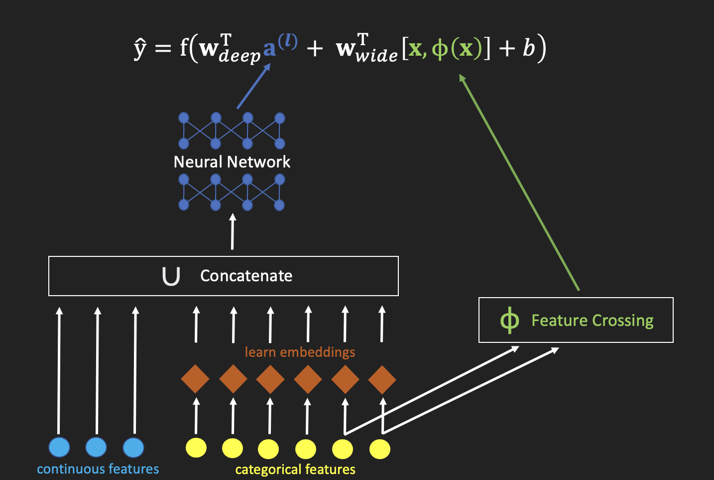

# Notes of Recommender Systems

The goal of this document is to provide an overview of all of the major recommendation algorithms.


Specifically, for each algorithm, my goal is to provide:

- An intuitive (high level) explanation of how the algorithm works

- A description of the contexts in which the algorithm can be applied (and the contexts in which it is effective, or ineffective)

- The algorithm's main strengths and weaknesses

A lot of the content in this document is from the book [Recommender Systems: The Textbook](https://link.springer.com/book/10.1007/978-3-319-29659-3) by Charu C. Aggarwal - this is a phenomenal resource.

# Contents

| Section                                                                              | Section Status                                       |
| ------------------------------------------------------------------------------------ | ---------------------------------------------------- |
| [A Note on Notation](#a-note-on-notation)                                            | COMPLETED                                            |
| [Goals of Recommender Systems](#goals-of-recommender-systems)                        | COMPLETED                                            |
| [Design Patterns](#design-patterns)                                                  | COMPLETED (can be extended)                          |
| User Embeddings & Item Embeddings                                                    | COMPLETED                                            |
| Collaborative Filtering                                                              | COMPLETED                                            |
| Collaborative Filtering: Neighbourhood: User-User Similarity                         | COMPLETED                                            |
| Collaborative Filtering: Neighbourhood: Item-Item Similarity                         | COMPLETED                                            |
| Collaborative Filtering: Neighbourhood: Combining User-User and Item-Item Similarity | COMPLETED                                            |
| Collaborative Filtering: Matrix Factorization                                        | COMPLETED                                            |
| Collaborative Filtering: Neighbourhood: Graph-Based                                  | needs final edit                                     |
| Collaborative Filtering: Naïve Bayes                                                 | needs final edit                                     |
| Content-Based Recommendation                                                         | needs final edit                                     |
| Content-Based Recommendation: Raw Text Preprocessing                                 | needs final edit                                     |
| Raw Text Preprocessing python function                                               | need to add my existing python script (and document) |
| Creating User & Item Characterization Vectors                                        | still TODO                                           |
| Supervised Learning                                                                  | needs final edit                                     |
| Multi-Armed Bandits                                                                  | needs final edit                                     |
| Vincent’s Lemma: Serendipity                                                         | needs final edit                                     |
| Association Rules-Based Recommendation                                               | needs final edit                                     |
| Sequential Pattern Mining                                                            | still TODO                                           |
| Clustering-Based Recommendation                                                      | still TODO                                           |
| Graph-Based Collaborative Filtering                                                  | needs final edit                                     |
| Matrix Factorization (Latent Factor Models)                                          | needs final edit                                     |
| Naïve Bayes Collaborative Filtering                                                  | needs final edit                                     |
| [Knowledge-Based Recommendation](#knowledge-based-recommendation)                    | needs final edit                                     |
| Knowledge-Based Recommendation: Constraint-Based                                     | needs final edit                                     |
| Knowledge-Based Recommendation: Case-Based                                           | needs final edit                                     |
| Hybrid Systems                                                                       | needs final edit                                     |
| Graph Neural Networks (GNNs)                                                         | needs final edit                                     |
| Tradeoffs Between Various Recommendation Algorithms                                  | partially completed                                  |
| Factorization Machines                                                               | needs final edit                                     |
| Incorporating Context                                                                | needs final edit                                     |
| Incorporating Context: Contextual Pre-Filtering                                      | needs final edit                                     |
| Incorporating Context: Contextual Post-Filtering                                     | needs final edit                                     |
| Incorporating Context: Contextual Modelling                                          | needs final edit                                     |
| Incorporating Context: Contextual Modelling: Contextual Latent Factor Models         | partially completed                                  |
| Incorporating Context: Contextual Modelling: Contextual Neighbourhood-Based Models   | still TODO                                           |
| Session-Based Recommendation                                                         | still TODO                                           |
| Wide & Deep Model                                                                    | needs final edit                                     |
| Deep & Cross Model                                                                   | needs final edit                                     |
| Two Tower Model                                                                      | needs final edit                                     |
| Recommendations for Groups of Users                                                  | partially completed                                  |
| Knowledge Graphs                                                                     | still TODO                                           |
| Integrating Latent Factor Models with Arbitrary Models                               | partially completed                                  |

### A Note on Notation

[\[back to contents\]](#contents)

Although I use

$$r_{ijc}=\text{user } i \text{'s rating of item } j \text{ in context } c$$

as the outcome of interest throughout this document, this can be more generally understood as

$$r_{ijc}=\text{user } i \text{'s affinity for item } j \text{ in context } c$$

The exact outcome of interest $r_{ijc}$ will depend on the particular recommendation domain (e.g. the outcome of interest could be '_probability of click_' in a web recommendation context, or it could be '_explicit user rating of video X_' in a media streaming context).

In general, a higher value of $r_{ijc}$ indicates a more favourable outcome.

# Goals of Recommender Systems

[\[back to contents\]](#contents)

Quoted parts of this section come from the paper [Diversity, Serendipity, Novelty, and Coverage: A Survey and Empirical Analysis of Beyond-Accuracy Objectives in Recommender Systems](https://dl.acm.org/doi/10.1145/2926720) by Marius Kaminskas and Derek Bridge.

1. **Relevance**: The primary goal of standard [recommender systems](https://en.wikipedia.org/wiki/Recommender_system) is to highlight, for each user, the subset of items which are most **relevant** to them. In other words, to highlight to each user the items which they would be most interested in (the items with the most utility to them).

However, there are some important secondary goals that are also very important in many cases:

2. **Novelty**: Recommended items should be ones that a user has not seen before (or ones that the user could not easily find on their own).

3. **Serendipity**: Item recommendations should sometimes be unexpected (pleasantly surprising) to the user. Serendipity is "finding valuable or pleasant things that are not looked for" (read ).


4. **Diversity**: "In information retrieval.. [covering] a broad area of the information space increases the chance of satisfying the user's information need." This is because a user's intent is often ambiguous (e.g. whether "bat" refers to an animal or to a piece of sporting equipment), and returning a diverse result set makes it more likely that what the user is looking for is in it. In other words, it's often a good idea to _hedge your bets_. This concept is similarly applicable to recommendation systems: since one can never been sure exactly what is most relevant to a particular user, it is safer to recommend a diverse set of options to them.

5. **Coverage**: "_Coverage_ reflects the degree to which the generated recommendations cover the catalogue of available items." This is important both for users (since it improves the usefulness/depth of the system) and for business-owners (because showing users the same small subset of the item catalogue might impact stock level management of physical items, and also because there has been a general societal shift in consumer demand for products in the [long tail](https://en.wikipedia.org/wiki/Long_tail) of the catalogue).

6. **Non-Offensive**: Certain items (or specific item combinations) can be worse than irrelevant for a particular user - a recommendation might actually **offend** them. An example is an item recommendation (or combination of items) which perpetuates a racial stereotype. It can be very important to identify these offensive user/item combinations since a single **offensive** recommendation can result in the permanent loss of a user.

7. **Responsibility/Compliance**: It is sometimes irresponsible (or illegal) to recommend certain user/item combinations (e.g. recommending alcohol to a recovering alcoholic, or guns to a minor).

8. **Long-Term Engagement**: In many recommendation domains, the primary business goal is to grow a base of engaged long-term (and returning) users. However, it is often quite difficult to objectively measure performance on a long-term objective like this, and more measurable short-term proxies tend to be monitored instead. Optimising for a short-term proxy objective (such a _click rate_) can sometimes actually be detrimental to a true long-term objective (such as _% of users who return_). An example of this is the use of overly sensationalistic or purposefully controversial content in a news portal - this is likely to draw a lot of short-term attention, but users are unlikely to return. Good item recommendations should promote long-term user engagement with the system.

9. **Perception of System Intelligence**: A single bad recommendation (an obvious mistake) can ruin a set of otherwise perfect recommendations. This is because users tend to be naturally distrustful of automated systems (sometimes even actively seeking out their flaws in order to validate their skepticism). It can sometimes be more important to ensure that the weakest recommendation in a set is not too bad than it is to ensure that the strongest recommendations in it are very good.

There is a good discussion of the topic (the multiple goals of recommender systems), and of how these outcomes can be optimized and objectively measured, in the paper [Diversity, Serendipity, Novelty, and Coverage: A Survey and Empirical Analysis of Beyond-Accuracy Objectives in Recommender Systems](https://dl.acm.org/doi/10.1145/2926720)

Some further notes:

- There is a blurred line between a [search engine](https://en.wikipedia.org/wiki/Search_engine) and a [recommender system](https://en.wikipedia.org/wiki/Recommender_system). Traditionally, [search engines](https://en.wikipedia.org/wiki/Search_engine) tended to be more user-agnostic (same result for each user) and use an explicit user query, whereas [recommender systems](https://en.wikipedia.org/wiki/Recommender_system) tended to be more hyper-personalized (different result for each user) and use implicit user signals. However, the systems are increasingly overlapping. Certainly, algorithms and insights from both domains are relevant to the recommendation problem.

- Recommendation models exist which are designed to simultaneously optimize multiple (sometimes conflicting) objectives. For example, refer to [Multi-Objective Recommender Systems: Survey and Challenges](https://arxiv.org/abs/2210.10309).

- To go a level deeper: the relative preference for _relevance_, _novelty_, _serendipity_, _diversity_, _catalogue coverage_, etc. of item recommendations is likely different for each unique user. For example, some users might prefer more narrow/conservative recommendations, while others might prefer more wild/exploratory recommendations. This meta-personalization can also be explictly modelled.

# Design Patterns

[\[back to contents\]](#contents)

Here are some examples of general recommendation system strategies:

- **Hyper Personalisation**: Try to guess exactly which subset of items is most relevant for each individual user

- **Similar Products**: Show user variants of an item that they are currently browsing/interested in (differing on 1 or more product dimension) e.g. "similar item but cheaper", "same item but in red", "similar item from another brand"

- **Complementary Products**: Highlight items which go well with/add value to/are often bought alongside the user's current item (or one which they already own)

- **New Products**: Highlight items recently added to the item catalogue

- **Popular/Trending**: Highlight items popular/trending globally, within a user's segment, or within the current context (e.g. current time, current season, user-chosen genre etc.)

- **Product Replenishment**: Predict timing of user need for an item to be renewed/replenished/replaced

- **Search Engine**: Give users an intelligent system for navigating the item catalogue. See also [Knowledge-Based Recommendation](#knowledge-based-recommendation). This could be text query based, conversational, via user interface, image-based etc.

# User Embeddings & Item Embeddings {#embeddings_explanation}

[\[back to contents\]](#contents)

The [embedding](#embeddings_explanation) is a powerful tool, included as a component in many different models. It is simply a real-valued vector which encodes useful information about an entity, optimized for use in a specific task.

For example: in a recommendation context, we might be able to learn an informative 5-dimensional numeric vector representation ([embedding](#embeddings_explanation)) for each of our users, such as

$$\text{embedding of user ID 69420}:\quad\big[0.235,-0.981,99.64,-1.4,-4.1\big]$$

We can then directly use this [embedding](#embeddings_explanation) in various downstream applications, such as:

- As input features for a predictive model

- As input features for a user segmentation

- For creating data visualisations of the user population (a multi-dimensional view of users)

- As a compressed representation of a user (typically taking up an order less space than a sparse feature representation, sometimes with relatively little loss of information)

An [embedding](#embeddings_explanation) can also be interpreted as a representation of an object in a [latent space](https://en.wikipedia.org/wiki/Latent_space), meaning a vector space in which the position of an [embedding](#embeddings_explanation) vector in the space provides rich information about the object (not necessarily meaningful to a human, but definitely a highly predictive feature to include in a model).

[Embeddings](#embeddings_explanation) are especially useful in a recommendation context, since they are very effective at turning high-dimensional sparse vectors into dense low-dimensional ones (which are much easier to use in a model, and good for combatting [overfitting](https://en.wikipedia.org/wiki/Overfitting)).

The choice of the dimension of the [embeddings](#embeddings_explanation), and the algorithm used to learn them (which can be supervised or unsupervised), are both hyperparameters to be selected or optimized, and are definitely highly problem specific.

Here is a (definitely non-exhaustive) list of methods for creating [embeddings](#embeddings_explanation):

- [Auto-Encoder](https://en.wikipedia.org/wiki/Autoencoder)

- [Singular-Value Decomposition (SVD)](https://en.wikipedia.org/wiki/Singular_value_decomposition) (e.g. of the [user/item ratings matrix](#collab_filter))

- Learned directly via [gradient descent](https://en.wikipedia.org/wiki/Gradient_descent) (e.g. using [tensorflow](https://github.com/tensorflow/tensorflow) or [pytorch](https://github.com/pytorch/pytorch))

- Learned as parameters of a Bayesian model (such as a [Latent Dirichlet Allocation (LDA)](https://en.wikipedia.org/wiki/Latent_Dirichlet_allocation) model of the [user/item ratings matrix](#collab_filter))

- [Principal Component Analysis (PCA)](https://en.wikipedia.org/wiki/Principal_component_analysis) (e.g. of the user features or of the item features)

Here is [python code showing how embeddings are included in a TensorFlow model](./recsys_alg_implementation_code/embeddings_in_tensorflow.py)

Here is [python code showing how embeddings are included in a PyTorch model](./recsys_alg_implementation_code/embeddings_in_pytorch.py)

<br></br> <br></br> <br></br> <br></br> <br></br> <br></br> <br></br> <br></br> <br></br>

<br></br> <br></br> <br></br> <br></br> <br></br> <br></br> <br></br> <br></br> <br></br>

# Collaborative Filtering {#collab_filter}

<a href="#header">[back to contents]</a>


[Collaborative Filtering](https://en.wikipedia.org/wiki/Collaborative_filtering) refers, in general, to the process of inferring the unobserved preferences of entities (e.g. users) using the observed preferences of other entities in the system (e.g. other users). It is "collaborative" in the sense that entities (unwittingly) contribute information towards each others recommendations.

- In a recommendation context, this traditionally means learning structure from the observed entries in the user/item ratings matrix and then using this structure to predict the missing entries.

- It sometimes makes sense to preprocess the ratings matrix before attempting to learn structure from it e.g. mean-centring ratings within each user to mitigate individual user bias.

There are many different [Collaborative Filtering](#collab_filter) approaches, a handful of which I discuss here:

1. [Neighbourhood Collaborative Filtering: User-User Similarity](#user_user_collab_filter)

2. [Neighbourhood Collaborative Filtering: Item-Item Similarity](#item_item_collab_filter)

3. [Neighbourhood Collaborative Filtering: Combined User-User and Item-Item Similarity](#combine_user_user_item_item_collab_filter)

4. [Collaborative Filtering by Matrix Factorization](#intro_matrix_factor_collab_filter)

5. [Graph-Based Collaborative Filtering](#intro_graph_collab_filter)

6. [Naïve Bayes Collaborative Filtering](#intro_naive_bayes_collab_filter)

## Collaborative Filtering: Neighbourhood: User-User Similarity {#user_user_collab_filter}


- An unobserved rating for item $j$ by user $i$ is predicted as the average rating of item $j$ across the $k$ users most similar to user $i$ who have rated item $j$. This average can (if desired) be weighted proportionately to each user's similarity to user $i$.

  "_Average_" here could mean any aggregation function (_mean_, _mode_, _maximum_ etc.)

- $k$ is a parameter to be chosen or determined algorithmically

- _Similarity_ between 2 users is traditionally defined using the distance between their item rating vectors (i.e. their rows) in the [user/item ratings matrix](#collab_filter).

  [Vector distance metrics](https://en.wikipedia.org/wiki/Distance#Distances_in_physics_and_geometry) such as _cosine similarity_, _euclidean distance_, _manhattan distance_ etc. can be used for this purpose (using only the observed entries shared by both users).

- "_Closest $k$ neighbours_" can (if desired) be replaced by "_all neighbours within a distance of d_"

- Compared to [Item-Item Similarity](#item_item_collab_filter), [User-User Similarity](#user_user_collab_filter) tends to produce more [serendipitous](#recsys_goals) - if sometimes less relevant - recommendations (see also [Combining User-User & Item-Item Similarity](#combine_user_user_item_item_collab_filter)).

- Instead of (or in addition to) using the information in the [user/item ratings matrix](#collab_filter) to measure the similarity between users, one could utilise user attribute data directly (e.g. user demographic profile), or a [graph-based approach](#intro_graph_collab_filter).

## Collaborative Filtering: Neighbourhood: Item-Item Similarity {#item_item_collab_filter}


- [Item-Item collaborative filtering](#item_item_collab_filter) is mathematically identical to [User-User collaborative filtering](#user_user_collab_filter), except that the calculation is performed using items (columns of the [user/item rating matrix](#collab_filter)) instead of users (rows)

  i.e. an unobserved rating for item $j$ by user $i$ is estimated as the average rating by user $i$ over the $k$ most similar items to item $j$ that user $i$ has rated.

- _Similarity_ between 2 items is traditionally defined using the distance between their user-rating vectors (i.e. their columns) in the [user/item ratings matrix](#collab_filter).

- Compared to [User-User Similarity](#user_user_collab_filter), [Item-Item Similarity](#item_item_collab_filter) tends to produce more relevant - if sometimes more boring/obvious - recommendations (see also [Combining User-User & Item-Item Similarity](#combine_user_user_item_item_collab_filter)).

- Instead of (or in addition to) using the information in the [user/item ratings matrix](#collab_filter) to measure the similarity between items, one could utilise item attribute/content data directly (e.g. item text description), or a [graph-based approach](#intro_graph_collab_filter).

## Collaborative Filtering: Neighbourhood: Combining _User-User_ and _Item-Item_ Similarity {#combine_user_user_item_item_collab_filter}

Since any missing (unobserved) entry $r_{ij}$ in the [user/item ratings matrix](#collab_filter) can be estimated using either [User-User Similarity](#user_user_collab_filter) ($\hat{r}_{ij}^{(uuCF)}$) or [Item-Item Similarity](#item_item_collab_filter) ($\hat{r}_{ij}^{(iiCF)}$), it can also be estimated as a weighted average of the two:

$$\hat{r}_{ij} \quad=\quad \alpha \space \hat{r}_{ij}^{(uuCF)} + (1-\alpha) \space \hat{r}_{ij}^{(iiCF)} \quad,\quad\alpha\in[0,1]$$

..where the hyperparameter $\alpha$ can be used to control the balance between _item-item_ (more relevant recommendations) and _user-user_ (more serendipitous recommendations).

## Collaborative Filtering: Matrix Factorization {#intro_matrix_factor_collab_filter}

[Matrix factorization](#matrix_factor_collab_filter) refers to the process of learning a low-rank approximation of the [user/item ratings matrix](#collab_filter), then using this low-rank representation to infer the missing (unobserved) ratings in the matrix.


For more information, refer to the section [Matrix Factorization (Latent Factor Models)](#matrix_factor_collab_filter).

## Collaborative Filtering: Neighbourhood: Graph-Based {#intro_graph_collab_filter}

When using a [neighbourhood-based collaborative filtering](#user_user_collab_filter) approach, sparsity of the [ratings matrix](#collab_filter) can sometimes make it impossible to obtain a satisfactory set of similar users (items) for some of the users (items). This problem is elegantly solved by representing the relationships between users and/or items using a graph, since it allows one to measure the similarity between users (items) via intermediate users (items) e.g. users are considered more similar if they have a shorter path between them in the graph (even if they have no items in common).


For more information, refer to [Graph-Based Collaborative Filtering](#graph_collab_filter)

## Collaborative Filtering: Naïve Bayes {#intro_naive_bayes_collab_filter}

The unobserved entries in the user/item matrix can be estimated by modelling the item-rating process as a generative probabilistic process (i.e. the probability of a particular user giving a particular rating to a particular item is governed by a probability distribution).

$$
\begin{array}{lcl}p\Big(r_{uj}=v_s\Bigl|\text{observed ratings in } I_u\Big)
&=& \displaystyle\frac{p\Big(\text{observed ratings in } I_u\Bigl|r_{uj}=v_s\Big)
\times p\Big(r_{uj}=v_s\Big)}{
p\Big(\text{observed ratings in } I_u\Big)} \\
&\propto& p\Big(\text{observed ratings in } I_u\Bigl|r_{uj}=v_s\Big)
\times p\Big(r_{uj}=v_s\Big) \\
r_{uj} &=& \text{rating of item } j \text{ by user } u \\
v_s &=& \text{item rating (one of } l \text{ discrete ratings } \{v_1,v_2,...,v_l\}\text{)}\\
I_u &=& \text{set of items already rated by user } u \\
\end{array}
$$

Each of the quantities in this formula can be estimated directly from the data in the observed [user/item ratings matrix](#collab_filter).

For more information, refer to [Naïve Bayes Collaborative Filtering](#naive_bayes_collab_filter)

<br></br> <br></br> <br></br> <br></br> <br></br> <br></br> <br></br> <br></br> <br></br>

# Content-Based Recommendation {#content_based}

<a href="#header">[back to contents]</a>

```{r echo=FALSE}
knitr::kable(
  data.frame(
    user_ID = c(46290,46290,46290,46290),
    movie = c("movie A","movie B","movie C","movie D"),
    user_rating = c(5,3,4,1),
    length_hours = c(1.5, 2, 1.5, 3),
    origin_country = c("USA", "India", "UK", "USA"),
    budget_millions = c(50,60,100,4),
    genre = c("action","drama","action","romance"),
    description = c("a thrilling exploding adventure",
                    "an exotic adventure full of drama",
                    "things exploding everywhere",
                    "an american love story drama"
                    ),
    thrilling = c(1,0,0,0),
    exploding = c(1,0,1,0),
    adventure = c(1,1,0,0),
    exotic = c(0,1,0,0),
    drama = c(0,1,0,1),
    love = c(0,0,0,1)
  ),
  "pipe"
)
```

Table: Example User Item Consumption History

_Content-based recommendation_ systems generate recommendations using item attributes data. For example, over time one could build an item attribute _profile_ for a particular user (e.g. "user likes Italian and Indian food, but never orders red meat or chilli"), and use this _profile_ to tailor their future item recommendations.

An example of a content-based model is:

$$
\begin{array}{lcl} \hat{r}_{ij}
&=& \text{predicted rating/affinity for item } j \text{ by user } i \\
&=& f\Big(\overset{\rightarrow{}}{\mathbf{v}}_j, \mathcal{D}_L^{(i)}\Big) \\
&=& \text{some function of the attributes of item } j \text{ and the attributes of the items that user } i \text{ has previously consumed} \\
\overset{\rightarrow{}}{\mathbf{v}}_j &=& \text{vector of attributes of item } j \\
\mathcal{D}_L^{(i)} &=& \text{the set of items previously consumed by user } i \text{ (the item attribute vectors)} \\
f() &=& \text{any chosen function (e.g. nearest neighbour model)} \\
\end{array}
$$

Some examples of function $f()$ are:

1. The cosine distance between $\overset{\rightarrow{}}{\mathbf{v}}_j$ and an aggregation of the vectors in $\mathcal{D}_L^{(i)}$ (mean/max/sum etc.)

2. A [supervised learning](https://en.wikipedia.org/wiki/Supervised_learning) model using item attributes $\overset{\rightarrow{}}{\mathbf{v}}_j \space, \mathcal{D}_L^{(i)}$ as features. Note that a _content-based_ system builds a separate model for each individual user, which is notably different to the global models trained over all users [described in this section](#supervised_learning).

   Example: training a regression model to predict movie ratings for user _46290_ using the data in the table _"Example User Item Consumption History"_ above

   In this particular context, it is much more important that the chosen model is robust to overfitting (e.g. [elastic net](https://en.wikipedia.org/wiki/Elastic_net_regularization), [naive bayes](https://en.wikipedia.org/wiki/Naive_Bayes_classifier)), since in this case the data is likely to be wide (many features) and short (few examples).

3. Association Rules-Based Classifiers of the form

   $\{\text{item contains feature set A}\}=>\{\text{rating="like"}\}$

   Example: $\{\text{item_material="leather", item_colour="red"}\}=>\{\text{rating=dislike}\}$

   Note, again, that these rules are learned **separately** for each user (i.e. a particular rule applies only to 1 user)

   Refer also to [Association Rules-Based Recommendation](#arules), which describes the learning of rules which apply globally (i.e. to all users).

4. A neighbourhood-based model: the predicted rating for a new item (attribute vector $\overset{\rightarrow{}}{\mathbf{v}}_j$) is calculated as the aggregated rating (_vote_) over the closest $k$ items to $\overset{\rightarrow{}}{\mathbf{v}}_j$ in $\mathcal{D}_L^{(i)}$ (using cosine similarity, euclidean distance, manhattan distance etc.)

A content-based strategy is particularly effective in situations in which:

1. There is rich and predictive item attribute data available (structured or raw text)

2. Past user item consumption is predictive of their future preferences

Compared to [collaborative filtering](#collab_filter):

1. content-based recommendation can robustly recommend items with few or no ratings (i.e. it alleviates the [cold start problem](<https://en.wikipedia.org/wiki/Cold_start_(recommender_systems)>) for new items)

2. content-based recommendation tends to produce more relevant (if also more boring and obvious) recommendations. This is because it cannot recommend items outside of the users historic item attribute consumption (i.e. it won't recommend items outside of the scope of what they have consumed in the past)

If users are able to explicitly specify their own preferences (like a [knowledge-based recommendation system](#knowledge_based)), then this information can be incorporated into their item attribute preference _profile_ and affect their recommendations.

# Content-Based Recommendation: Raw Text Preprocessing {#raw_text_preprocessing}

<a href="#header">[back to contents]</a>

```{r echo=FALSE}
knitr::kable(
  data.frame(
    item_ID = c(111,112,113,114),
    raw_text_description = c("Strappy Red Bikini","Blue Suede Shoes","Formal Cotton Pants (Blue)","red sport shoe (football) with blue strap"),
    red_idf = c(1/2,0,0,1/2),
    blue_idf = c(0,1/3,1/3,1/3),
    bikini_idf = c(1,0,0,0),
    shoe_idf = c(0,1/2,0,1/2),
    pants_idf = c(0,0,1,0),
    strap_idf = c(1/2,0,0,1/2),
    formal_idf = c(0,0,1,0),
    sport_idf = c(0,0,0,1),
    suede_idf = c(0,1,0,0),
    cotton_idf = c(0,0,1,0)
  ),
  caption = "Example Item Text Data (terms with Inverse Document Frequency)"
)
```

In many recommendation contexts, there is typically a lot of raw text item description information available. Raw text can be extremely predictive, but it often requires a lot of data preprocessing steps in order to be used by a predictive model.

Item text is most simply coded in a (cleaned) [bag of words](https://en.wikipedia.org/wiki/Bag-of-words_model) representation, in which the component words are recorded in a [1-hot](https://en.wikipedia.org/wiki/One-hot) encoding format i.e. the order of the words is ignored, and only their occurrence (or their frequency of occurrence) is recorded. It is possible to include the information in the word order (i.e. proper language understanding) using a more complex model (such as a [Recurrent Neural Network](https://en.wikipedia.org/wiki/Recurrent_neural_network) or [Transformer](<https://en.wikipedia.org/wiki/Transformer_(machine_learning_model)>)) but this added complexity (and resource requirement) would need to be justified by an increase in model performance.

Here is a description of some common raw text preprocessing (cleaning) tasks:

- **Punctuation Removal**

  Sometimes the same word can be formatted in multiple different ways e.g. "JoAnne", "Joanne", "Jo-Anne", "jo-anne" etc. In order to prevent a model from considering these to be different words, it often makes sense to make all text lowercase, and to remove certain punctuation characters up-front (or to convert these characters into spaces).

- **Stop-Word Removal**

  Certain words are very common, and unlikely to have any predictive power. These are often removed up-front. Examples are "a","the","from","with" etc.

- **Stemming**

  It sometimes makes sense to convert all words with the same root into the same word e.g. $\{"hope","hoping","hopeful","hoped"\}=>"hope"$

- **Phrase Extraction (n-grams)**

  Sometimes, pairs of words (or even triplets of words or longer phrases) can be highly predictive. In this case, rather than counting occurrence (or frequency) of individual words, one can additionally count occurrence of [n-grams](https://en.wikipedia.org/wiki/N-gram) e.g. "hot dog", "one piece", "test suite" etc.

- **TF-IDF (Term Frequency-Inverse Document Frequency)**

  Words in a [bag of words](https://en.wikipedia.org/wiki/Bag-of-words_model) representation can be included/excluded/weighted based on their frequency (within a specific item description) and their rarity (across all items). Typically, it makes sense to upweight words which appear multiple times within the same item description (since this makes them likely to be characteristic of that item), and to downweight words which are very common across all items (since these words are unlikely to have discriminative power between items). There are many different weighting schemes - refer to [the TF-IDF Wikipedia page](https://en.wikipedia.org/wiki/Tf–idf) for more information.

- **Feature Selection**

  Words in a [bag of words](https://en.wikipedia.org/wiki/Bag-of-words_model) representation can be included/excluded/weighted based on their observed discriminative power on the training data. In this case, words are included/excluded/weighted separately for each user (i.e. each user has their own set of discriminative words). _Disciminative power_ can be measured using different metrics, for example the _Gini index_:

  $$
  \begin{array}{lcl}\text{Gini}(w) &=& 1-\displaystyle\sum_{i=1}^tp_i(w)^2 \\
  t &=& \text{number of possible item rating values} \\
  p_i(w) &=& \text{proportion of items containing word } w \text{ which were given rating } i \\
  \end{array}
  $$

  i.e. individual words highly correlated with a particular rating are more discriminative (lower _Gini index_).

  For more similar metrics (with various different strengths and weaknesses), refer to @RecSysTheTextBook.

  It can be very important to only include a small number of highly discriminative words in a content-based model, since text often generates a high-dimensional feature space whereas user item-consumption data is normally (relatively) quite small, which can easily lead to model overfitting.

<br></br> <br></br> <br></br> <br></br> <br></br> <br></br> <br></br> <br></br> <br></br>

# Creating User & Item Characterization Vectors

<a href="#header">[back to contents]</a>

TODO

refer also to [Raw Text Preprocessing](#raw_text_preprocessing)

<br></br> <br></br> <br></br> <br></br> <br></br> <br></br> <br></br> <br></br> <br></br>

# Supervised Learning {#supervised_learning}

<a href="#header">[back to contents]</a>

The problem of predicting a particular user's affinity for a particular item can be framed as a supervised learning problem, allowing us to use any one of the available plethora of performant classification, regression or ranking models (generalized linear models, gradient boosting, random forest, deep learning etc.).

The user rating (affinity) for a particular item is modelled as a function of the user's attributes, the item's attributes and (possibly) information on the recommendation context:

$$
\begin{array}{lcl}
r_{ijk} &=& f\Big(\mathbf{x}^{(user)}_i, \mathbf{x}^{(item)}_j, \mathbf{x}^{(context)}_k\Big) \\
\mathbf{x}^{(user)}_i &=& \text{vector of user attributes} \\
\mathbf{x}^{(item)}_j &=& \text{vector of item attributes} \\
\mathbf{x}^{(context)}_k &=& \text{vector of recommendation context information} \\
\end{array}
$$

A strength of this method is that it can mitigate the recommendation [cold start problem](<https://en.wikipedia.org/wiki/Cold_start_(recommender_systems)>) (in which recommendations cannot be generated for new users and/or items) by sharing information across users and items.

Note that user/item interaction data (à la [Collaborative Filtering](#collab_filter)) can be included in a [supervised learning](https://en.wikipedia.org/wiki/Supervised_learning) model by including a users' row in the [ratings matrix](#collab_filter) (or some aggregation of it) in the user's feature vector $\mathbf{x}^{(user)}_i$, or by including an item's column in the [ratings matrix](#collab_filter) (or some aggregation of it) in the item's feature vector $\mathbf{x}^{(item)}_j$.

Some specific examples of recommender architectures based on [supervised learning](https://en.wikipedia.org/wiki/Supervised_learning) are:

1. [Factorization Machines](#factorization_machines)

2. The [2 Tower](#two_tower) model

3. The [Wide & Deep](#wide_and_deep) model

4. The [Deep & Cross](#deep_and_cross) model

Another use of [supervised learning](https://en.wikipedia.org/wiki/Supervised_learning) in generating item recommendations is to build a separate model for every individual user using item attributes as model features: refer to [Content-Based Recommendation](#content_based).

<br></br> <br></br> <br></br> <br></br> <br></br> <br></br> <br></br> <br></br> <br></br>

# Multi-Armed Bandits

<a href="#header">[back to contents]</a>

[Multi-armed bandit](https://en.wikipedia.org/wiki/Multi-armed_bandit) algorithms are a class of [reinforcement learning](https://en.wikipedia.org/wiki/Reinforcement_learning) model which are designed to maximise some objective in an environment in which one must repeatedly choose from one of a discrete set of available options (observing a noisy reward signal after each decision).


The classic analogy for this is a gambling machine with multiple levers, each lever having an unknown reward distribution: the player must balance _exploration_ (pulling levers not pulled much before) with _exploitation_ (pulling levers historically observed to generate high reward) in order to maximise total reward over multiple lever pulls (iterations).

Recommendation systems often favour items for which there is a lot of observed user interaction data, and [multi-armed bandit](https://en.wikipedia.org/wiki/Multi-armed_bandit) algorithms aid the system in exploring the unexplored items in the catalogue in a principled way. They do this by directly modelling uncertainty and exploration.

[Multi-armed bandit](https://en.wikipedia.org/wiki/Multi-armed_bandit) algorithms are also important in a recommendation context in which the system must make decisions _online_ i.e. a user reacts to a provided set of item recommendations and there is insufficient time to retrain a model incorporating this information before the user requires a new set of item recommendations (recommending them the same items again is a bad user experience).

**Example**: item recommendations are available from 5 different recommendation models (all trained offline) and we would like to investigate which of the 5 (or what weighting of them) is most appropriate for a particular user. We would like to respond to user feedback (e.g. click/no click on a recommended product) in real time i.e. that user's feedback will affect what they are recommended next, without us having to wait for the models to retrain.

Some examples of popular [multi-armed bandit](https://en.wikipedia.org/wiki/Multi-armed_bandit) algorithms are:

1. [Thompson Sampling](https://en.wikipedia.org/wiki/Thompson_sampling)

2. Upper Confidence Bound (UCB)

3. $\epsilon$-Greedy (and variants)

An extension called [Contextual Multi-Armed Bandit](https://en.wikipedia.org/wiki/Multi-armed_bandit#Contextual_bandit) algorithms explicitly incorporate context into the arm-selection decision. Some examples of these are:

1. linUCB [@linUCB]

2. Greedy Linear Bandit & Greedy-First Linear Bandit [@greedyLinearBandit]

3. RegCB [@regCB]

<br></br> <br></br> <br></br> <br></br> <br></br> <br></br> <br></br> <br></br> <br></br>

# Vincent's Lemma: Serendipity

<a href="#header">[back to contents]</a>

This is a simple and heuristic method (created by [Vincent Warmerdam](https://koaning.io)) that was found to substantially increase the [coverage](#recsys_goals) of item recommendations in a commercial movie recommendation context.

It is a system for _next item recommendation_.

It shares some conceptual similarities with [Association Rules-Based Recommendation](#arules)

$$
\begin{array}{lcl}
R_{j\rightarrow{}i} &=& \text{relative affinity for item } i \text{ among item } j \text{ consumers compared to the rest of the user population} \\
&=& \displaystyle\frac{\text{% of item } j \text{ consumers have also consumed item }i}{\text{% of non-item } j \text{ consumers have also consumed item }i} \\
&=& \displaystyle\frac{p(s_i\bigl|s_j)}{p(s_i\bigl|s_j^c)} \\
&\approx& \displaystyle\frac{p(s_i\bigl|s_j)}{p(s_i\bigl)} \\
\end{array}
$$

For users who have consumed item $j$, the item $i$ with the highest score $R_{j\rightarrow{}i}$ should be recommended to them.

For items with a low amount of user interaction, the $R_{j\rightarrow{}i}$ score will be unstable. This could be alleviated by making the calculation Bayesian, and shrinking the metric using a chosen prior distribution.

<br></br> <br></br> <br></br> <br></br> <br></br> <br></br> <br></br> <br></br> <br></br>

# Association Rules-Based Recommendation {#arules}

<a href="#header">[back to contents]</a>

[Association Rules](https://en.wikipedia.org/wiki/Association_rule_learning) are rules of the form

$$\overset{\text{antecedant set}}{\{...\}} \quad\overset{\text{implies}}{=>} \quad \overset{\text{consequent set}}{\{...\}}$$

Very efficient algorithms such as the [a priori](https://en.wikipedia.org/wiki/Apriori_algorithm) algorithm have been devised for searching data for rules of this form.

[Association Rules](https://en.wikipedia.org/wiki/Association_rule_learning) are particularly effective in the case of unary ratings.

Here are some of the ways that [association Rules](https://en.wikipedia.org/wiki/Association_rule_learning) can be used to generate item recommendations:

1. **Item-wise Recommendations**:

   - $\overset{\text{item set}}{\{...\}} \quad\overset{\text{implies}}{=>} \quad \overset{\text{item set}}{\{...\}}$
   - Example: $\{\text{bread, tomato}\}=>\{\text{cheese}\}\quad$ i.e. users who have bought _bread_ and _tomato_ should be recommended _cheese_.

2. **User-wise Recommendations**

   - $\overset{\text{user set}}{\{...\}} \quad\overset{\text{implies}}{=>} \quad \overset{\text{user set}}{\{...\}}$
   - Example: $\{\text{alice, bob}\}=>\{\text{john}\}\quad$ i.e. if users "Alice" and "Bob" have bought bought an item then "John" is also likely to like it

3. **Profile Assocation Rules**:

   - $\overset{\text{user attribute set}}{\{...\}} \quad\overset{\text{implies}}{=>} \quad \overset{\text{item set}}{\{...\}}$
   - Example: $\{\text{male, age30-39, 2_children}\}=>\{\text{home loan}\}\quad$ i.e. a large proportion of male users in their 30s with 2 children have consumed the item "home loan", making it a promising recommendation for this user segment

Here is [python code showing how global association rules can be used to generate recommendations](./recsys_alg_implementation_code/global_arules_recommendations.py)

<br></br> <br></br> <br></br> <br></br> <br></br> <br></br> <br></br> <br></br> <br></br>

# Sequential Pattern Mining

<a href="#header">[back to contents]</a>

TODO

<br></br> <br></br> <br></br> <br></br> <br></br> <br></br> <br></br> <br></br> <br></br>

# Clustering-Based Recommendation

<a href="#header">[back to contents]</a>

TODO

<br></br> <br></br> <br></br> <br></br> <br></br> <br></br> <br></br> <br></br> <br></br>

# Graph-Based Collaborative Filtering {#graph_collab_filter}

<a href="#header">[back to contents]</a>

When using a [neighbourhood-based collaborative filtering](#user_user_collab_filter) approach, sparsity of the [ratings matrix](#collab_filter) can sometimes make it impossible to obtain a satisfactory set of similar users (items) for some of the users (items). This problem is elegantly solved by representing the relationships between users and/or items using a graph, since it allows one to measure the similarity between users (items) via intermediate users (items) e.g. users are considered more similar if they have a shorter path between them in the graph (even if they have no items in common).
Relationships between users and items can be cleanly described (and modelled) using graphs, in which nodes represent entities (e.g. user or item) and edges represent relationships between them.

Graphs define a novel measure of distance (dissimilarity) between entities: the length of a path between them, travelling along edges (e.g. using the shortest path, or using a random walk).


- If required, edges can have different weights, describing the strength (and sign) of the connection (relationship) between nodes (entities).

- Graphs are an effective solution to the problem of data sparsity e.g. most users have rated only a tiny proportion of all items, because even users with no items in common can be linked through intermediate users in the graph.

- Graphs structures can be coded directly (e.g. [NetworkX](https://github.com/networkx/networkx)), or using a model (there are MANY deep learning approaches). Model-based methods also facilitate tasks such as link (edge) prediction.

Here is [python code implementing graph-based collaborative filtering using NetworkX and graph-walker](./recsys_alg_implementation_code/user_item_networkx.py)


See also: [Graph Neural Networks](#graph_neural_nets)

<br></br> <br></br> <br></br> <br></br> <br></br> <br></br> <br></br> <br></br> <br></br>

# Matrix Factorization (Latent Factor Models) {#matrix_factor_collab_filter}

<a href="#header">[back to contents]</a>

[Matrix factorization](#matrix_factor_collab_filter) refers to the process of learning a low-rank approximation of the user/item ratings matrix, then using this low-rank representation to infer the missing (unobserved) ratings in the matrix.

```{r include=FALSE}
# I used this code to generate the example shown in the image
latent_dim <- 3
n_users <- 6
n_items <- 10
set.seed(69)
user_latent_factors <-
  round(
    matrix(
      data = runif(min=0, max=2, n=n_users*latent_dim),
      nrow = n_users,
      ncol = latent_dim
  ),
  digits = 1
)
item_latent_factors <-
  round(
    matrix(
      data = runif(min=0, max=2, n=n_items*latent_dim),
      nrow = n_items,
      ncol = latent_dim
  ),
  digits = 1
)
user_latent_factors
item_latent_factors

est_ratings_matrix <- round( user_latent_factors %*% t(item_latent_factors) )
#write.csv(est_ratings_matrix,"test.csv")
```


There are many different ways in which this matrix factorization can be performed, each of which has various different strengths and weaknesses. These variants are defined by the constraints which they impose on the latent factors. Imposing constraints on the latent factors will always decrease accuracy (increase error) on the observed (training) data, but these constraints can also improve model generalization (error on unobserved data) and increase model interpretability.

Here is a summary of factorization methods from [@RecSysTheTextBook] -

| Method                                        | Constraints on factor matrices | Advantages/disadvantages                                                                                                                                                                                              |
| --------------------------------------------- | ------------------------------ | --------------------------------------------------------------------------------------------------------------------------------------------------------------------------------------------------------------------- |
| Unconstrained                                 | none                           | Highest quality solution <br>Good for most matrices <br>Regularisation prevents overfitting <br>Poor interpretability                                                                                                 |
| Singular Value Decomposition (SVD)            | orthogonal basis               | Good visual interpretability <br>Out-of-sample recommendations <br>Good for dense matrices <br>Poor semantic interpretability <br>Suboptimal in sparse matrices                                                       |
| Maximum Margin                                | none                           | Highest quality solution <br>Resists overfitting <br>Similar to unconstrained <br>Poor interpretability <br>Good for discrete ratings                                                                                 |
| Non-Negative Matrix Factorization (NMF)       | non-negativity                 | Good quality solution <br>High semantic interpretability <br>Loses interpretability with both like/dislike ratings <br>Less overfitting in some cases <br>Best for implicit feedback                                  |
| Probabilistic Latent Semantic Analysis (PLSA) | non-negativity                 | Good quality solution <br>High semantic interpretability <br>Probabilistic interpretation <br>Loses interpretability with both like/dislike ratings <br>Less overfitting in some cases <br>Best for implicit feedback |

Table: The Family of Matrix Factorization Methods

Matrix factorization models can also be combined with other recommender algorithms within a single model architecture. Refer to the following sections for more information:

1. [Integrating Latent Factor Models with Arbitrary Models](#integrate_latent_factor_with_arb_models)

2. [Hybrid Systems](#hybrid_systems)

Latent factor models can also explicitly model recommendation context (refer to section [Contextual Latent Factor Models](#context_latent_factor)).

As with all [collaborative filtering](#collab_filter), latent factor models suffer from the [cold start problem](<https://en.wikipedia.org/wiki/Cold_start_(recommender_systems)>) (i.e. they struggle to generate recommendations for new users and new items). This problem is somewhat alleviated by the [two tower model](#two_tower), which is a natural extension incorporating user and item features into the model.

Here are python code implementations of matrix factorization:

- [Tensorflow implementation of matrix factorization (python)](./recsys_alg_implementation_code/matrix_factorization_in_tensorflow.py)

- [PyTorch implementation of matrix factorization (python)](./recsys_alg_implementation_code/matrix_factorization_in_pytorch.py)

Performing matrix factorization in an [automatic differentiation](https://en.wikipedia.org/wiki/Automatic_differentiation) framework such as [tensorflow](https://github.com/tensorflow/tensorflow) or [pytorch](https://github.com/pytorch/pytorch) is not the fastest way to perform matrix factorization, but provides a general model framework which is easy to extend e.g. to incorporate additional data sources such as item attributes or recommendation context (e.g. see [Two Tower Models](#two_tower) and [Integrating Latent Factor Models with Arbitrary Models](#integrate_latent_factor_with_arb_models)).

<br></br> <br></br> <br></br> <br></br> <br></br> <br></br> <br></br> <br></br> <br></br>

# Naïve Bayes Collaborative Filtering {#naive_bayes_collab_filter}

<a href="#header">[back to contents]</a>

Another way to estimate unobserved entries in the user/item matrix is to model the rating of items as a generative probabilistic process (i.e. the probability of a particular user giving a particular rating to a particular item is governed by a probability distribution).

$$
\begin{array}{lcl}p\Big(r_{uj}=v_s\Bigl|\text{observed ratings in } I_u\Big)
&=& \displaystyle\frac{p\Big(\text{observed ratings in } I_u\Bigl|r_{uj}=v_s\Big)
\times p\Big(r_{uj}=v_s\Big)}{
p\Big(\text{observed ratings in } I_u\Big)} \\
&\propto& p\Big(\text{observed ratings in } I_u\Bigl|r_{uj}=v_s\Big)
\times p\Big(r_{uj}=v_s\Big) \\
r_{uj} &=& \text{rating of item } j \text{ by user } u \\
v_s &=& \text{item rating (one of } l \text{ discrete ratings } \{v_1,v_2,...,v_l\}\text{)}\\
I_u &=& \text{set of items already rated by user } u \\
\end{array}
$$

Each of the quantities in this formula can be estimated directly from the data in the observed [user/item ratings matrix](#collab_filter).

Note that the denominator $p\Big(\text{observed ratings in } I_u\Big)$ (if it is needed) need not be estimated directly - it can be calculated using the basic probability law $\displaystyle\sum_{s=1}^l p\Big(r_{uj}=v_s\Bigl|\text{observed ratings in } I_u\Big) = 1$.

$p\Big(r_{uj}=v_s\Big)$ (probability of user $u$ giving rating $v_s$ to item $j$ prior to observing any data on user $u$) can be estimated using $\hat{p}\Big(r_{uj}=v_s\Big)=\displaystyle\frac{\text{number of users who have given rating } v_s \text{ to item } j}{\text{number of users who have rated item } j }$.

$p\Big(\text{observed ratings in } I_u\Bigl|r_{uj}=v_s\Big)$ (the relative likelihood of of the observed ratings for the items $I_u$ given a specific rating $v_s$ for item $j$) can be simply estimated (using a **VERY** strong independence assumption) using:

$$
\begin{array}{lcl}\hat{p}\Big(\text{observed ratings in } I_u\Bigl|r_{uj}=v_s\Big) &=& \displaystyle\prod_{k\in I_u}p\Big(r_{uk}\Bigl|r_{uj}=v_s\Big) \\
\hat{p}\Big(r_{uk}\Bigl|r_{uj}=v_s\Big) &=& \displaystyle\frac{\text{number of users who have given rating } v_s \text{ to item } j \text{ and rating } r_{uk} \text{ to item } k }{\text{number of users who have given rating } v_s \text{ to item } j} \end{array}
$$

This assumption of independence between the probabilities of user $u$'s ratings for the items in $I_u$ (after observing their rating of item $j$) is extremely unrealistic, but can still result in a performant model in practice.

<br></br> <br></br> <br></br> <br></br> <br></br> <br></br> <br></br> <br></br> <br></br>

# Knowledge-Based Recommendation

<a href="#header">[back to contents]</a>

[Knowledge-based recommender systems](#knowledge_based) generate recommendations by combining an explicit user query with domain knowledge/algorithmic intelligence (e.g. user attributes, item attributes, historic item consumption data, recommendation context, item availability etc.). In this way, they lie somewhere on the spectrum between a pure queryless [recommender system](https://en.wikipedia.org/wiki/Recommender_system) and a [search engine](https://en.wikipedia.org/wiki/Search_engine).

[Knowledge-based recommendation](#knowledge_based) is typically facilitated through an iterative/cyclic exchange between the user and an interactive user interface, for example:

$$\text{user query} >> \text{query result} >> \text{refined user query} >> \text{refined query result} >> \text{refined user query} >> \text{refined query result} >> ...\text{etc. (until user finds a satisfactory item)}$$
[Knowledge-based recommender systems](#knowledge_based) are well-suited to recommendation contexts in which each item is unique, and not sold often (e.g. houses and cars).

## Knowledge-Based Recommendation: Constraint-Based

User provides a set of constraints, and item recommendations are then provided from the subset of items matching the user constraints (the items within the subset can be further ranked by a relevance model). Example constraints for a house search:

- "homes in East London"

- "price < $100"

- "bathrooms > 2"

After receiving the query result, the user can refine their constraint set (make the search more liberal or more conservative) and rerun the query.


## Knowledge-Based Recommendation: Case-Based

User provides a case/target/anchor item, and the recommender system then finds other items similar to it, possibly along user-specified item dimensions. Example "_please find me songs similar to "Come Together" by the Beatles_.


<br></br> <br></br> <br></br> <br></br> <br></br> <br></br> <br></br> <br></br> <br></br>

# Hybrid Systems {#hybrid_systems}

<a href="#header">[back to contents]</a>

A _hybrid_ system is one that integrates multiple different models into a single combined architecture.

Here are some examples:

- **Model Stacking**

  _Stacking_ (also called model _blending_) involves using the outputs of multiple different predictive models as input features for a single meta model (a _prediction aggregator_), which outputs a single prediction.

  

  The aggregator/generalizer model can optionally also include additional _meta features_ as input (in addition to the outputs of the level 0 models). A classic example is using the number of items that a particular user has rated as a _meta feature_ in the aggregator/generalizer model.

  A good example of such a _weighted stacking model_ is @FWLS.

- **Switching Hybrid**

  The recommendation context dictates which model (out of a selection of models) is used for a particular case (e.g. recommendation system A is used for new users and system B for returning users). Or, the context determines the relative weighting of the models in a combined ensemble of models.

- **Bagging**

  _Bagging_ (**B**ootstrap **Agg**regat**ing**) involves fitting the same model multiple times to bootstrapped versions of the training data (i.e. resamples of it, sampling with replacement), then computing a single prediction as the average (or other aggregation) of the predictions from these models. Optionally, additional measures (such as column sampling) can be used to further increase the diversity of the training samples. _Bagging_ helps to reduce overfitting and improve model generalization. A classical example of _bagging_ is the [Random Forest](https://en.wikipedia.org/wiki/Random_forest) model.

- **Boosting**

  _Boosting_ involves fitting models sequentially, where each model is designed to correct for the prediction errors made by the previous models. This can involve sample reweighting (samples with larger errors in previous models are upweighted to make future models focus more on them e.g. [AdaBoost](https://en.wikipedia.org/wiki/AdaBoost)) or it can involve directly learning the errors of previous models (e.g. [Gradient Boosting Machines](https://en.wikipedia.org/wiki/Gradient_boosting))

- **Collaborative Content Features**

  A [collaborative filtering](#collab_filter) approach is used to create item attribute features which can be used by a [content-based](#content_based) model

  Example (book recommendation): [collaborative filtering](#collab_filter) is used to identify "similar authors" for each book, then this information is used as an item (book) attribute in a [content-based](#content_based) model.

  

- **Content-Based Matrix Completion**

  A [content-based](#content_based) model is used to fill in the missing (unobserved) entries in a ratings matrix, and then [collaborative filtering](#collab_filter) is used on that complete (dense) ratings matrix (possibly downweighting the inferred entries in the computation)

- **Successive Refinement (Cascade)**

  Applying a sequence of increasingly performant models in order to repeatedly reduce the size of the candidate set of items, so as to remove obviously irrelevant items prior to the use of more resource-intensive models.

  

- **Knowledge-Augmented Content-Based Filtering**

  Explicit user input is combined with item attributes data in a [content-based](#content_based) i.e. a single model that is both [knowledge-based](#knowledge_based) and [content-based](#content_based)).

- **Collaborative Filtering via Content Neighbourhood**

  The peer group (set of closest users) for a user is determined using content (item attribute) data, and the predicted rating for an item is the average rating for that item amongst this peer group (i.e. standard [collaborative filtering](#collab_filter), but where the peer group is not determined using the ratings matrix)

  

- **Collaborative Filtering using Content Model**

      Converting the information in the ratings matrix into item-attributes data allows one to use a [content-based](#content_based) model to perform [collaborative filtering](#collab_filter).

      For example, a particular item will be labelled with keyword features such as "user=69&rating=2", "user=420&rating=5" etc.

      Depending on the [content-based](#content_based) model used, this has a one-to-one mapping with actual [collaborative filtering](#collab_filter) algorithms [@RecSysTheTextBook]:

      "
      * A nearest neighbor classifier on this representation approximately maps to an item-

  based neighborhood model for collaborative filtering.

      * A regression model on the content approximately maps to a user-wise regression model

  for collaborative filtering.

      * A rule-based classifier on the content approximately maps to an user-wise rule-based

  classifier for collaborative filtering.

      * A Bayes classifier on the content approximately maps to a user-wise Bayes model for

  collaborative filtering.

      "

- **Mixed Hybrids**

  _Mixed hybrids_ assemble a coherent **set** of item recommendations for a user from a large number of predictions from multiple different systems. @RecSysTheTextBook gives the example of a _travel bundle_ - recommended accommodation from one model, recommended leisure activities from a second model, and recommended restaurants from a third are combined to produce a _travel package_ of recommendations (possibly including restrictions on which items can be recommended together e.g. in a similar location or price range).

<br></br> <br></br> <br></br> <br></br> <br></br> <br></br> <br></br> <br></br> <br></br>

# Graph Neural Networks (GNNs) {#graph_neural_nets}

<a href="#header">[back to contents]</a>

[Graph Neural Networks](https://en.wikipedia.org/wiki/Graph_neural_network) (GNNs) are a powerful tool for (elegantly) incorporating user/item interaction data ([collaborative filtering](#collab_filter)), user attribute data (demographic filtering), and item attribute data ([content-based filtering](#content_based)) within a single model.

They are particularly powerful for recommendation tasks since the relationships between users and items are often well-captured by a graph representation.


GNNs can also model heterogeneous relationships (link types) between nodes (e.g. an edge between a user node and item node within the same graph could represent either a "view", a "click" or a "purchase").

GNNs learn a unique $d^{(K)}$-dimensional real-valued vector representation (_[embedding](#embeddings_explanation)_) of each node in a given graph. These node _[embedding](#embeddings_explanation)s_ can then be used directly as model features (inputs) in downstream modelling tasks (e.g. edge/link prediction).

The node _[embedding](#embeddings_explanation)s_ are learned using an _encoder/decoder_ architecture:

- An _encoder_ model takes in a raw numeric description vector of a node as input (either simply a node ID look-up vector, or else a feature/attribute vector for the node) and outputs a node _[embedding](#embeddings_explanation)_ for that node (a custom vector representation of the node that is optimized in order to be used for a specific downstream task).

- A _decoder_ model takes in the output of the _encoder_ model for a given node (i.e. a node _[embedding](#embeddings_explanation)_ vector) and outputs information which can be used to reconstruct the local structure of the original graph around that node.

- The parameters of the _encoder_ and _decoder_ model are jointly optimized during model training. For example, the _encoder_ and _decoder_ might be jointly trained in order to predict whether any give pair of nodes are connected (neighbours) or not in the original graph.


Here is a general description of a typical structure for the _encoder_ model:

1. Each node $u$ is initialized with a real-valued vector representation $\mathbf{x}_u=\mathbf{h}_u^{(0)}$ (containing the nodes attribute data)

2. Each node ($u$)'s vector representation $\mathbf{h}_u^{(0)}$ is updated by combining it with an aggregation of the vector representations of it's immediate neighbours (this is called _message passing_):

$$
\begin{array}{lcl}
\underset{\text{vector representation }\\\text{of node } u \text{ at iteration } \\k+1}{\underbrace{h_u^{(k+1)}}} &=& \underset{\text{some chosen}\\\text{function}\\\text{(e.g. neural net)}}{\underbrace{\text{UPDATE}}}\Big(\underset{\text{vector representation}\\\text{of node } u \text{ at}\\\text{iteration } k}{\underbrace{\mathbf{h}_u^{(k)}}}, \underset{\text{some aggregation of the vector}\\\\\text{representations (at iteration } k \text{)}\\\text{of the nodes linked to } u \\\text{ (i.e. combined information from}\\u\text{'s immediate 1-hop neighbours) }}{\underbrace{\mathbf{m}^{(k)}_{\mathcal{N}(u)}}}\Big) \\
\mathbf{m}^{(k)}_{\mathcal{N}(u)} &=& \underset{\text{some chosen}\\\text{function}\\\text{(e.g. sum)}}{\underbrace{\text{AGGREGATE}}}\bigg(\underset{\text{set of vector representations}\\\text{of all nodes neighbouring}\\\text{(directly linked to) node } u \\\text{(at iteration }k\text{)}}{\underbrace{\Big\{\mathbf{h}_v^{(k)},\forall v \in \mathcal{N}(u)\Big\}}}\bigg)\\
\end{array}
$$

3. Step (2) (previous update step) is (potentially) repeated multiple times. Since each update step passes information between immediate neighbours, multiple update steps result in nodes incorporating information from their more distant neighbours.


4. After $K$ update steps, the resulting vector representation $\mathbf{z}_u=\mathbf{h}_u^{(K)}$ is a numeric [embedding](#embeddings_explanation) containing information both about the node $u$ itself and about the local structure of the graph around the node $u$.

The choices of the $\text{UPDATE()}$ and $\text{AGGREGATE()}$ functions define the _encoder_ architecture. Very many different ones have been proposed (refer to e.g. @GraphRepresentationLearningBook).

Here is a basic example (from @GraphRepresentationLearningBook):

$$
\begin{array}{lcl}
\mathbf{h}_u^{(k+1)} &=& \overset{\text{UPDATE()}}{\overbrace{\sigma\Bigg(\mathbf{W}_{self}^{(k+1)}\mathbf{h}_u^{(k)}+\mathbf{W}_{neigh}^{k+1}\underset{\text{AGGREGATE()}}{\Big(\underbrace{\displaystyle\sum_{v\in \mathcal{N}(u)}\mathbf{h}_v^{(k)}}\Big)} + \mathbf{b}^{(k+1)}\Bigg)}} \\
\sigma() &=& \text{element-wise non-linear function ('activation function') such as } tanh, sigmoid, ReLU \text{ etc.} \\
\mathbf{W}_{self}^{(k+1)}, \mathbf{W}_{neigh}^{(k+1)} &\in& \mathbb{R}^{d^{(k+1)}\times d^{(k)}} \space \text{are matrices of trainable parameters (weights)}\\
\mathbf{b}^{(k+1)} &\in& \mathbb{R}^{d^{(k+1)}} \text{ is a vector of trainable parameters (weights)} \\
d^{(k+1)} &=& \text{dimension of vector representation (embedding) at iteration } k+1 \\
\end{array}
$$

$$
\overset{\mathbf{W}^{(k+1)}}{\begin{bmatrix}\cdot&\cdot&\cdot&\cdot\\\cdot&\cdot&\cdot&\cdot\end{bmatrix}} \overset{\mathbf{h}_*^{(k)}}{\begin{bmatrix}\cdot\\\cdot\\\cdot\\\cdot\end{bmatrix}}
\quad=\quad
\overset{\mathbf{h}_*^{(k+1)}}{\begin{bmatrix}\cdot\\\cdot\end{bmatrix}}
$$

See also: Graphs can be used in order to directly model the similarity between users (or between items) for direct use in a [collaborative filtering](#collab_filter) model - refer to [Graph-Based Collaborative Filtering](#graph_collab_filter).

@DTplusGNN

<br></br> <br></br> <br></br> <br></br> <br></br> <br></br> <br></br> <br></br> <br></br>

# Tradeoffs Between Various Recommendation Algorithms

<a href="#header">[back to contents]</a>

| algorithm                                                                                                        | can incorporate user/item interaction data                                                                                      | can incorporate user attribute data | can incorporate item attribute data | can incorporate recommendation context data | training time | strengths                     | weaknesses | explainable recommendations |
| ---------------------------------------------------------------------------------------------------------------- | ------------------------------------------------------------------------------------------------------------------------------- | ----------------------------------- | ----------------------------------- | ------------------------------------------- | ------------- | ----------------------------- | ---------- | --------------------------- |
| [template](#link)                                                                                                | ?                                                                                                                               | ?                                   | ?                                   | ?                                           | ?             | ?                             | ?          | ?                           |
| [template](#link)                                                                                                | ?                                                                                                                               | ?                                   | ?                                   | ?                                           | ?             | ?                             | ?          | ?                           |
| [Association Rules](#arules)                                                                                     | ?                                                                                                                               | ?                                   | ?                                   | ?                                           | ?             | ?                             | ?          | ?                           |
| [Content-Based Filtering](#content_based)                                                                        | ?                                                                                                                               | ?                                   | ?                                   | ?                                           | ?             | ?                             | ?          | ?                           |
| [Factorization Machine](#factorization_machines)                                                                 | yes                                                                                                                             | yes                                 | yes                                 | yes                                         | fast          | ?                             | ?          | ?                           |
| [Feature-Weighted Linear Stacking](#fwls)                                                                        | ?                                                                                                                               | ?                                   | ?                                   | ?                                           | ?             | ?                             | ?          | ?                           |
| [Graph Neural Network (GNN)](#graph_neural_nets)                                                                 | yes                                                                                                                             | yes                                 | yes                                 | no                                          | medium        | ?                             | ?          | no                          |
| [Matrix Factorization (Latent Factor Model)](#matrix_factor_collab_filter)                                       | yes                                                                                                                             | no                                  | no                                  | no                                          | fast          | ?                             | ?          | no                          |
| [Naive Bayes Collaborative Filtering](#naive_bayes_collab_filter)                                                | ?                                                                                                                               | ?                                   | ?                                   | ?                                           | ?             | ?                             | ?          | ?                           |
| [Neighbour-Based Collaborative Filtering:User-User and/or Item-Item](#combine_user_user_item_item_collab_filter) | ?                                                                                                                               | ?                                   | ?                                   | ?                                           | ?             | ?                             | ?          | ?                           |
| [Neighbour-Based Collaborative Filtering:Graph-Based](#graph_collab_filter)                                      | ?                                                                                                                               | ?                                   | ?                                   | ?                                           | ?             | ?                             | ?          | ?                           |
| [Two Tower Model](#two_tower)                                                                                    | yes, if user ID [embedding](#embeddings_explanation) and item ID [embedding](#embeddings_explanation) are included in the model | yes                                 | yes                                 | yes                                         | medium        | alleviates cold start problem | ?          | no                          |

<br></br> <br></br> <br></br> <br></br> <br></br> <br></br> <br></br> <br></br> <br></br>

# Factorization Machines {#factorization_machines}

<a href="#header">[back to contents]</a>

_Factorization Machines_ (@Rendle2010FactorizationM) are simply linear regression models with interactions, but in which the model coefficients on the interaction terms are modelled using a latent factor model. This factorization helps to avoid overfitting and improve generalization, especially when modelling sparse data. This is achieved by breaking the independence between the interaction coefficients (i.e. allowing/forcing information sharing between them).


The basic model is defined:

$$
\begin{array}{lcl}
\hat{y}_i(\overrightarrow{\mathbf{x}}_i) &:=& \underset{\text{standard linear regression}}{\underbrace{w_0 + \displaystyle{\sum_{i=1}^p}w_ix_i}} + \underset{\text{latent factor model of all 2-way interactions}}{\underbrace{\displaystyle{\sum_{i=1}^p\sum_{j=i+1}^p<\overrightarrow{\mathbf{v}}_i,\overrightarrow{\mathbf{v}}_j>}x_ix_j}} \\
\space &\space& w_0\in \mathbb{R}, \quad\overrightarrow{\mathbf{w}} \in \mathbb{R}^{p}, \quad \mathbf{V} \in \mathbb{R}^{p \times k} \\
\end{array}
$$

- The hyperparameter $k$ (latent factor dimension) is a parameter to be tuned - it controls the flexibility (constrainedness) of the interaction portion of the model.

- They are suitable for modelling extremely large (e.g. 1 billion rows) and sparse datasets (e.g. recommender engines).

- The model equation can be computed in linear time $O(kp)$ and can be optimized using gradient descent, which makes training feasible for extremely large datasets.

- The model can be extended to capture higher order (e.g. 3-way) interactions (up to arbitrary order).

- The model can be trivially modified in order to solve binary classification or ranking problems.

- _Factorization Machines_ are often included as a component/module in a more complex model (e.g. _DeepFM_).

<br></br> <br></br> <br></br> <br></br> <br></br> <br></br> <br></br> <br></br> <br></br>

# Incorporating Context {#context}

<a href="#header">[back to contents]</a>

In certain domains, the context (e.g. time, season, user location, user device etc.) in which the recommendation is delivered can have a material effect on the relevance of the recommendation. Obvious examples are the season (e.g. winter) in which clothing items are being recommended, or the location of the user for a restaurant recommendation.


@RecSysTheTextBook describes 3 broad approaches:

1. [Contextual Pre-Filtering](#context_pre_filter): A separate recommendation model is built for each unique context (i.e. on a 2-Dimensional user/item "slice" of the ratings hypercube).

2. [Contextual Post-Filtering](#context_post_filter): A global model (which ignores all contextual information) is built. The predictions from this model are then adjusted using contextual information. A very simple example of this is to built a recommendation model on all items, but then only allow winter clothing to be recommended in winter.

3. [Contextual Modelling](#context_model): Contextual information is explicitly used within the architecture of the recommendation model.

## Incorporating Context: Contextual Pre-Filtering {#context_pre_filter}

In [contextual pre-filtering](#context_pre_filter), a separate standard recommendation model is built for each unique context (i.e. on a 2-Dimensional user/item "slice" of the ratings hypercube).


For example, if the contextual dimensions were

1. _user location_

2. _time of day_

..then an independent model would be built for every unique _user location_/_time of day_ combination, with each individual model train on only the observed ratings within that _user location_/_time of day_ slice of the data.

This technique increases data sparsity, which achieves relevance at the cost of increased variance/risk of overfitting. The granularity of the context segment (slice of the data) can be adjusted in order to control the balance between relevance and sparsity. For example, one could model each of the time contexts as an hourly slice:

$$\{\text{8pm, 9pm, 10pm, ...}\}$$

..or rather reduce the granularity of this context to 3-hourly slices:

$$\{\text{"1pm-3pm", "4pm-6pm", "7pm-9pm", ...}\}$$

This granularity decision can be:

1. **Heuristic**: e.g. using the finest granularity containing at least $n$ observed ratings

2. **Ensemble-Based**: model multiple different granularities using separate models and then combine their predictions into a single prediction.

3. **Decided using Cross-Validation**: find the optimal granularity on a chosen metric using holdout data

## Incorporating Context: Contextual Post-Filtering {#context_post_filter}

In [contextual post-filtering](#context_post_filter), a global recommendation model (which ignores all contextual information) is built. The predictions from this global model are then adjusted using contextual information.

@RecSysTheTextBook describes 2 general approaches:

1. **Heuristic**: Generate predictions for all user/item pairs using the global model, and then to simply screen out items which are irrelevant to the recommendation context at prediction time (e.g. show user the highest ranked winter items during winter).

2. **Model-based**: $$\begin{array}{lcl} \hat{r}_{ijc} &=& \text{predicted rating of item } j \text{ by user } i \text{ in context } c \\
&=& \overset{\text{local model}}{\overbrace{p(i,j,c)}} \quad \times \overset{\text{global model}}{\overbrace{\quad\hat{r}_{ij}\quad}} \\
p(i,j,c) &=& \text{predicted relevance of item } i \text{ to user } j \text{ in context } c \\
\hat{r}_{ij} &=& \text{predicted rating of item } i \text{ by user } j \text{ (using global model trained without context data)} \\
\end{array}$$
   note that $p(i,j,c)$ could alternatively be replaced by a model $p(j,c)$ which does not consider the user.

## Incorporating Context: Contextual Modelling {#context_model}

A [contextual model](#context_model) explicitly incorporates the recommendation context data into the architecture of the model itself.

Some examples are:

- [Supervised Learning](#supervised_learning)

- [Contextual Latent Factor Models](#context_latent_factor)

- [Contextual Neighbourhood-Based Models](#context_neighbour)

## Incorporating Context: Contextual Modelling: Contextual Latent Factor Models {#context_latent_factor}

Explanation here TODO!

One example is **Pairwise Interaction Tensor Factorization** (TODO: ref), which is defined:

(source: @RecSysTheTextBook)

$$
\begin{array}{lcl}
\hat{r}_{ijc} &=& \text{predicted rating of item } j \text{ by user } i \text{ in context } c \\
&=& (\mathbf{U}\mathbf{V}^T)_{ij} + (\mathbf{V}\mathbf{W}^T)_{jc} + (\mathbf{U}\mathbf{W}^T)_{ic} \\
&=& \displaystyle\sum_{s=1}^k \Big(u_{is}v_{js} + v_{js}w_{cs} + u_{is}w_{cs}\Big) \\
m &=& \text{number of unique users} \\
n &=& \text{number of unique items} \\
d &=& \text{number of unique contexts} \\
k &=& \text{dimension of latent space} \\
\mathbf{U} &\in& \mathbb{R}^{m\times k} \quad \text{(matrix of user factors)} \\
\mathbf{W} &\in& \mathbb{R}^{n\times k} \quad \text{(matrix of item factors)} \\
\mathbf{V} &\in& \mathbb{R}^{d\times k} \quad \text{(matrix of context factors)} \\
\end{array}
$$

## Incorporating Context: Contextual Modelling: Contextual Neighbourhood-Based Models {#context_neighbour}

TODO

<br></br> <br></br> <br></br> <br></br> <br></br> <br></br> <br></br> <br></br> <br></br>

# Session-Based Recommendation

<a href="#header">[back to contents]</a>

@session_based_survey

<br></br> <br></br> <br></br> <br></br> <br></br> <br></br> <br></br> <br></br> <br></br>

# Wide & Deep Model {#wide_and_deep}

<a href="#header">[back to contents]</a>

Inspired by the observation that shallow models (like [linear models](https://en.wikipedia.org/wiki/Generalized_linear_model)) tend to be better at _memorization_ (finding specific reoccurring patterns in data) while deep models tend to be better at _generalization_ (approximating the structure of the underlying data-generating system), the Wide and Deep [@WideAndDeep] model is an architecture containing both a _wide_ component and a _deep_ component - an attempt to combine the specific strengths of these 2 different models in a unified framework.

Google evaluated this model for app recommendation on their app store [Google Play](https://play.google.com).



More specifically:

- The Wide & Deep model is designed to solve "large-scale regression and classification problems with sparse inputs."

- The _wide_ portion of the model is a [Generalized Linear Model (GLM)](https://en.wikipedia.org/wiki/Generalized_linear_model).

- The _deep_ part of the model is a [Feed-Forward (Dense) Neural Network](https://en.wikipedia.org/wiki/Feedforward_neural_network).

- The parameters of both parts (_wide_ and _deep_) are optimized simultaneously during model training.

- Continuous input features are fed directly into the _deep_ part of the model.

- Categorical input features are either:

  1. Embedded into a $k$-dimensional numeric representation then fed into the _deep_ part of the model. These [embedding](#embeddings_explanation)s are learned directly during training. [embedding](#embeddings_explanation) dimension $k$ is a hyperparameter to be chosen/optimized (i.e. not learned during training).
  2. Embedded into a $k$-dimensional numeric representation then fed into the _deep_ part of the model **and** (independently and in parallel) feature-crossed and then fed into the _wide_ part of the model.

     **Example**: categorical feature _[user_occupation]_...

     - ...contributes 5-dimensional embedding $\Big(\text{[user_occupation]=='musician'}\Big)\rightarrow{}[-0.34,0.01,5.90,-6.94,1.12]$ as input to _deep_ part
     - ...contributes binary input $X_j=\Big(\text{[user_occupation]=='musician'}\Big) \in \{0,1\}$ as input to _wide_ part
     - ...contributes binary crossed feature $X_j=\Big(\text{[user_occupation]=='musician'}\&\text{[user_gender]=='female'}\Big) \in \{0,1\}$ as input to _wide_ part
     - ...contributes binary crossed feature $X_j=\Big(\text{[user_occupation]=='musician'}\&\text{[user_city]=='London'}\Big) \in \{0,1\}$, as input to _wide_ part

- The outputs of the _deep_ and _wide_ components are then linearly combined (using weights $\mathbf{W}_{deep}$ and $\mathbf{W}_{wide}$ learned during training) and a chosen activation function (e.g. sigmoid for binary classification) is applied in order to generate the model output/prediction. A baseline/bias term $b$ (also learned during training) is also added into the linear combination.

- Many variants of this model exist, such as DeepFM ([@DeepFM]), Deep & Cross Network ([@DCNV2]), TODO...

<br></br> <br></br> <br></br> <br></br> <br></br> <br></br> <br></br> <br></br> <br></br>

# Deep & Cross Model {#deep_and_cross}

<a href="#header">[back to contents]</a>

The Deep & Cross [@DCNV2] model is a modification of the [Wide & Deep](#wide_and_deep) model architecture, but designed to learn explicit low-level feature interaction terms in an automated way.

It accomplishes this using _cross layers_ (see illustration below). Stacking multiple _cross layers_ in parallel results in increasing degrees of feature interaction (1 cross layer gives first order interactions _ab_, 2 cross layers gives 2nd order interactions _abc_ etc.). Polynomial terms are also created ($a^3$, $a^2b$ etc.).


For a deeper understanding of the behaviour of this cross layer, refer to [this resource](https://j-sephb-lt-n.github.io/exploring_statistics/dcn_v2_cross_layer_investigation.html).

Architectures explanation:


[STILL IN PROGRESS: Here is a PyTorch (python) implementation of the Deep & Cross model](./recsys_alg_implementation_code/deep_and_cross_pytorch.py)

<br></br> <br></br> <br></br> <br></br> <br></br> <br></br> <br></br> <br></br> <br></br>

# Two Tower Model {#two_tower}

<a href="#header">[back to contents]</a>

The [Two Tower](#two_tower) model is a natural extension of the [Matrix Factorization (Latent Factor)](#matrix_factor_collab_filter) model, additionally incorporating user features and item features into the architecture (which helps to alleviate the [cold start problem](<https://en.wikipedia.org/wiki/Cold_start_(recommender_systems)>) inherent in [collaborative filtering](#collab_filter) models in general).

The architecture consists of 2 distinct and parallel models, the parameters of which are optimized simultaneously during model training:

1. a user-encoder (which outputs a user [embedding](#embeddings_explanation))

2. an item-encoder (which outputs an item [embedding](#embeddings_explanation))

The outputs of the 2 encoders are then combined to produce a single model prediction.


Note that in order to be an extension of the [matrix factorization (latent factor)](#matrix_factor_collab_filter) model, the [two tower](#two_tower) model must learn a latent representation ([embedding](#embeddings_explanation)) of the user (concatenated with the input user features) and a latent representation ([embedding](#embeddings_explanation)) of the item (concatenated with the input item features). The model will still work without these latent factors, but is no longer a straightforward extension of the [matrix factorization (latent factor)](#matrix_factor_collab_filter) model (it no longer explicitly contains the user/item interaction information).

Although I couldn't find any mention of it in the literature, incorporating context data into the [two tower](#two_tower) model by including a third tower (a context encoder) seems like a logical extension of the architecture. In this case, the _dot product_ operation (which combines the outputs of the towers into a single prediction) would need to be replaced by another operation (such as a feedforward neural network).

Here is [a python implementation of the 2-Tower model using TensorFlow](./recsys_alg_implementation_code/2tower_tensorflow.py)

<br></br> <br></br> <br></br> <br></br> <br></br> <br></br> <br></br> <br></br> <br></br>

# Recommendations for Groups of Users

<a href="#header">[back to contents]</a>

There are situations in which multiple different users consume (share) a single item. Examples are social movie, restaurant or tourist activity recommendation. In this case the item preferences of all of the users must be taken simultaneously into account. The recommendation problem becomes one of user preference aggregation, and optimal compromise.

Some factors to consider are:

- The utility (satisfaction) of the most, average, and least satisfied user in the group

- Homogeneity/heterogeneity of the group (i.e. how similar user preferences are within the group)

- Social dynamics within the group

  - **Emotional Contagion**: The satisfaction (or dissatisfaction) of users in the group affects the satisfaction (or dissatisfaction) of the other users in the group
  - **Conformity**: When users explicitly express their item preferences, this alters the item preferences of the other users in the group (either truly changing their preferences, or causing them to become dishonest about them)

Here are some algorithmic strategies for tackling the group recommendation problem:

| Strategy Name                           | Type               | Description                                                                                                                                                                                                                                                                                                                                                                                                        |
| --------------------------------------- | ------------------ | ------------------------------------------------------------------------------------------------------------------------------------------------------------------------------------------------------------------------------------------------------------------------------------------------------------------------------------------------------------------------------------------------------------------ |
| Aggregated Voting                       | Rating Aggregation | The predicted utility of (preference for) an item is the average (the mean, or some other aggregation function) of the predicted utility for that item over all users in the group. This has been seen to perform badly for heterogeneous groups.                                                                                                                                                                  |
| Least Misery                            | Rating Aggregation | The predicted utility of (preference for) an item is the minimum predicted utility for that item among all users in the group i.e. we aim to ensure that no member of the group is too unhappy with a recommendation                                                                                                                                                                                               |
| Aggregated Voting with Misery Threshold | Rating Aggregation | The same as **Aggregated Voting**, except that items which do not pass a minimum predicted utility threshold for all users in the group are given a predicted group utility of 0                                                                                                                                                                                                                                   |
| User Profile Aggregation                | ?                  | User profiles are combined into a single group profile (using some aggregation function such as mean, minimum, maximum, set union, set intersection etc.) and this "meta-user" is used to generate item recommendations as if it were an individual user. User profiles might be [content-based](#content_based), [collaborative-filtering](#collab_filter)-based, user [embeddings](#embeddings_explanation) etc. |
| Knowledge-Based                         | ?                  | Conceptually similar to individual user [knowledge-based](#knowledge_based) recommendation: Allow the group to explicitly state, or interactively explore, their requirements. Alternatively, allow individual users to input their preferences and then aggregate that information into a group content profile)                                                                                                  |

<br></br> <br></br> <br></br> <br></br> <br></br> <br></br> <br></br> <br></br> <br></br>

# Knowledge Graphs

<a href="#header">[back to contents]</a>

This section still TODO

<br></br> <br></br> <br></br> <br></br> <br></br> <br></br> <br></br> <br></br> <br></br>

# Integrating Latent Factor Models with Arbitrary Models {#integrate_latent_factor_with_arb_models}

<a href="#header">[back to contents]</a>

[Latent factor models](#matrix_factor_collab_filter) can be integrated with another recommendation architecture (i.e. be included as a module within the overall architecture, where the latent factors are learned simultaneously with the other model parameters) using a simple linear combination:

$$
\begin{array}{lcl}
\hat{r}_{ijl} &=& \underset{\text{main effects:}\\\text{user generosity &}\\\text{item popularity}}{\underbrace{\quad o_i + p_j \quad}} + \underset{\text{matrix factorization/}\\\text{latent factor model}}{\underbrace{\quad \overrightarrow{u}_i \cdot \overrightarrow{v}_j \quad}} + \beta \space  f\bigg(\underset{\text{content model}}{\underbrace{\overrightarrow{c}_i^{(user)}, \overrightarrow{c}_j^{(item)}}}, \underset{\text{collaborative model}}{\underbrace{\overrightarrow{r}_i^{(user)}, \overrightarrow{r}_j^{(item)}}},
\underset{\text{context}\\\text{info.}}{\underbrace{\overset{\rightarrow{}}{\hspace{5mm}z_l\hspace{5mm}}}}
\bigg)\\
\space &\space& \space \\
\hat{r}_{ijl} &=& \text{predicted rating of item } j \text{ by user } i \text{ in context } l\\
o_i &=& \text{user } i \text{ bias (e.g. user who rates all items highly)} \\
p_j &=& \text{item } j \text{ bias (e.g. item that all users rate highly)} \\
\overrightarrow{u}_i &=& \text{latent factor representation of user } i\\
\overrightarrow{v}_j &=& \text{latent factor representation of item } j \\
\overset{\rightarrow{}}{z} &=& \text{recommendation context information (vector)}\\
\beta &=& \text{adjustment/weight of non-latent portion of model} \\
f() &=& \text{any chosen function (e.g. linear regression)} \\
\overrightarrow{c}_i^{(user)} &=& \text{user } i \text{ attribute/content vector} \\
\overrightarrow{c}_j^{(item)} &=& \text{item } j \text{ attribute/content vector} \\
\overrightarrow{r}_i &=& \text{user } i \text{ observed ratings vector (row of user/item ratings matrix)} \\
\overrightarrow{r}_j &=& \text{item } j \text{ observed ratings vector (column of user/item ratings matrix)} \\
\end{array}
$$

Some possible choices of function $f()$ are:

- A [Supervised Learning](#supervised_learning) model

- A [Neighbourhood-based Collaborative Filtering](#user_user_collab_filter) model (the content vectors are ignored)

- A [Hybrid](#hybrid_systems) system

- A [Content-Based](#content_based) model (the ratings vectors are ignored)

<br></br> <br></br> <br></br> <br></br> <br></br> <br></br> <br></br> <br></br> <br></br>

# References {#references}

<a href="#header">[back to contents]</a>
